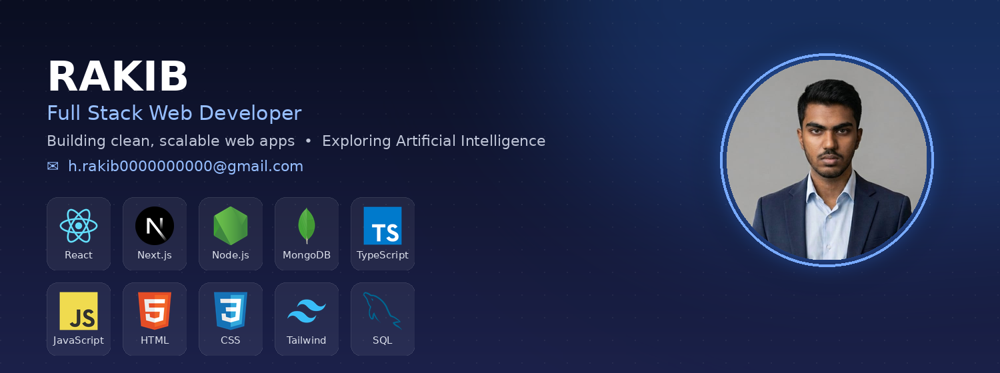

<h1 align="center">Hi 👋, I'm Rakib </h1>


## 👨‍💻 About Me

Hi! I'm **Rakib**, a passionate **Future Full Stack Developer** from Bangladesh 🇧🇩.

- 🎓 Currently pursuing a **Diploma in Computer Science & Technology**
- 💻 Building modern and responsive web applications
- ⚛️ Working with **React, TypeScript, JavaScript & Tailwind CSS**
- 🚀 Currently learning **Next.js, Node.js, Express.js & MongoDB**
- 🧠 Passionate about **problem solving and clean UI/UX**
- 🔨 Building projects to strengthen my **Full Stack Development** skills
- 🌱 Continuously learning and improving my development skills
- 🤝 Open to **collaboration, open-source projects & learning opportunities*
-  🌐 Hold **CCNA** and **MTCNA (MikroTik)** certifications — I understand systems from the network layer up to the browser
- 🔐 Hands-on with cybersecurity fundamentals (TryHackMe, SOC concepts, recon tooling)
- ✍️ I write code that explains **why**, not just what — clarity over cleverness, always
- 🚀 Open to internships, freelance work, and collaborative full-stack projects

---

# 📫 Connect With Me

<p align="center">
  <a href="h.rakib0000000000@gmail.com">
    
  </a>
  &nbsp;&nbsp;
  <a href="" target="blank"></a>
  &nbsp;&nbsp;
  <a href="https://github.com/Rakib304832" target="_blank">
    
  </a>
</p>


# 🛠️ Tech Stack

## Frontend

<p align="center">

</p>

## Backend

<p align="center">

</p>

## Databases

<p align="center">

</p>

## Cloud & DevOps

<p align="center">

</p>

## Networking & Security
<br/>
 &nbsp;


# 🐍 CONTRIBUTION SNAKE

<div align="center">


</div>

---

<p></p>

<p>&nbsp;</p>

<p></p>

# 📚 Learning Journey

```text
HTML → CSS → JavaScript
              ↓
          TypeScript
              ↓
            React
              ↓
           Next.js
              ↓
      Node.js + Express
              ↓
           MongoDB
              ↓
       Full Stack Developer 🚀

```
