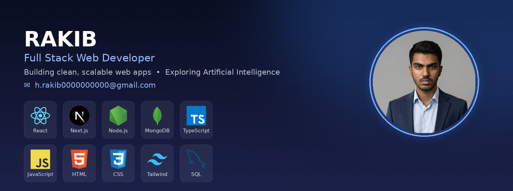

<h1 align="center">Hi 👋, I'm Rakib </h1>


## 👨‍💻 About Me

Hi! I'm **Rakib**, a passionate **Future Full Stack Developer** from Bangladesh 🇧🇩.

- 🎓 Currently pursuing a **Diploma in Computer Science & Technology**
- 💻 Building modern and responsive web applications
- ⚛️ Working with **React, TypeScript, JavaScript & Tailwind CSS**
- 🚀 Currently learning **Next.js, Node.js, Express.js & MongoDB**
- 🧠 Passionate about **problem solving and clean UI/UX**
- 🔨 Building projects to strengthen my **Full Stack Development** skills
- 🌱 Continuously learning and improving my development skills
- 🤝 Open to **collaboration, open-source projects & learning opportunities*
-  🌐 Learning networking fundamentals (Cisco Packet Tracer — DHCP, RIP, OSPF, EIGRP — That is give me a advantage for web security.
- 🔐 Hands-on with cybersecurity fundamentals (TryHackMe, SOC concepts, recon tooling)
- ✍️ I write code that explains **why**, not just what — clarity over cleverness, always
- 🚀 Open to internships, freelance work, and collaborative full-stack projects

---

# 📫 Connect With Me

<p align="center">
  <a href="h.rakib0000000000@gmail.com">
    
  </a>
  &nbsp;&nbsp;
  <a href="https://www.linkedin.com/in/rakib-hassan-955184434?utm_source=share_via&utm_content=profile&utm_medium=member_android" target="blank"></a>
  &nbsp;&nbsp;
  <a href="https://github.com/Rakib304832" target="_blank">
    
  </a>
</p>


# 🛠️ Tech Stack

## Frontend

<p align="center">

</p>

## Backend

<p align="center">

</p>

## Databases

<p align="center">

</p>

## Cloud & DevOps

<p align="center">

</p>

## Networking & Security
<p align="center">
  
</p>

# 🔥 GitHub Streak
<!-- ১. শিরোনাম: align="center" = মাঝখানে দেখাবে -->
<h1 align="center">হ্যালো, আমি Rakib 👋</h1>
<p align="center">Full Stack Web Developer হওয়ার পথে | CST শিক্ষার্থী | Networking ও Web Development</p>

<!-- ২. ব্যাজ: রিপোজিটরি সংখ্যা ও ফলোয়ার, GitHub API থেকে নিজে আপডেট হয় -->
<p align="center">
  
  
</p>

<!-- ৩. স্ট্রিক কার্ড: কন্ট্রিবিউশন ও স্ট্রিক দেখায় -->
<h2 align="center">🔥 GitHub Streak</h2>
<p align="center">
  
</p>

<!-- ৪. স্ট্যাটস ও ভাষা কার্ড: পাশাপাশি বসবে -->
<h2 align="center">📊 GitHub Stats</h2>
<p align="center">
  <!-- show_icons = আইকন, include_all_commits = সব সময়ের কমিট, count_private = প্রাইভেট কাজ গোনা -->
  
  <!-- layout=compact = ছোট বার-চার্ট, কোন ভাষায় কাজ বেশি -->
  
</p>

<!-- ৫. সেরা প্রজেক্ট: repo= এর পরে রিপোজিটরির নাম। আরও চাইলে একই ধরনের লাইন কপি করুন -->
<h2 align="center">🚀 My Projects</h2>
<p align="center">
  <a href="https://github.com/Rakib304832/Sign-up-Sign-in">
    
  </a>
  <!-- দ্বিতীয় প্রজেক্ট: YOUR-REPO-NAME বদলে আপনার রিপোজিটরির আসল নাম দিন -->
  <a href="https://github.com/Rakib304832/YOUR-REPO-NAME">
    
  </a>
</p>

<!-- ৬. যোগাযোগ: লিংকগুলো আপনার নিজের দিয়ে বদলান -->
<h2 align="center">📬 Connect with me</h2>
<p align="center">
  <a href="https://www.linkedin.com/in/YOUR-LINKEDIN"></a>
  <a href="mailto:YOUR-EMAIL@gmail.com"></a>
</p>

# 🐍 CONTRIBUTION SNAKE

<div align="center">


</div>

---


# 📚 Learning Journey

```text
HTML → CSS → JavaScript
              ↓
          TypeScript
              ↓
            React
              ↓
           Next.js
              ↓
      Node.js + Express
              ↓
           MongoDB
              ↓
       Full Stack Developer 🚀

```
